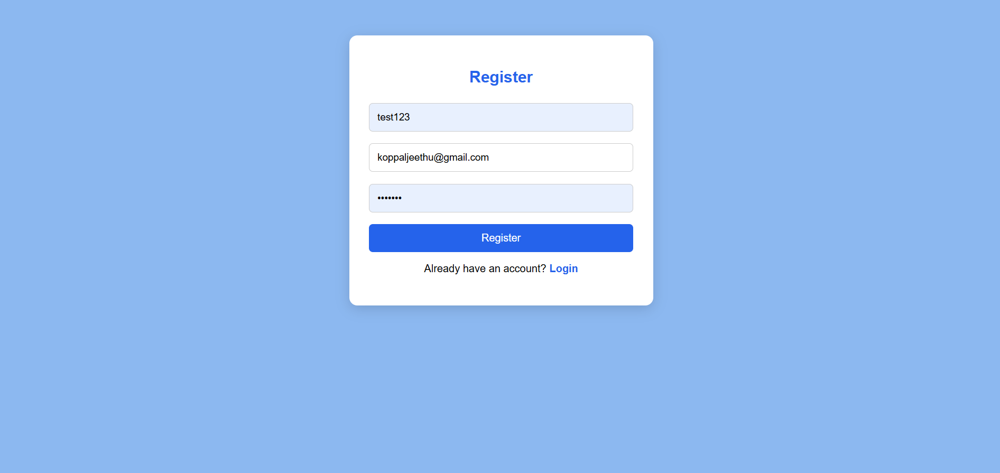
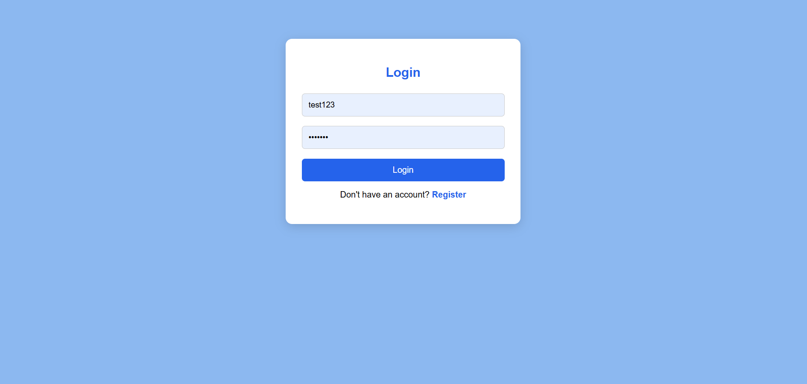
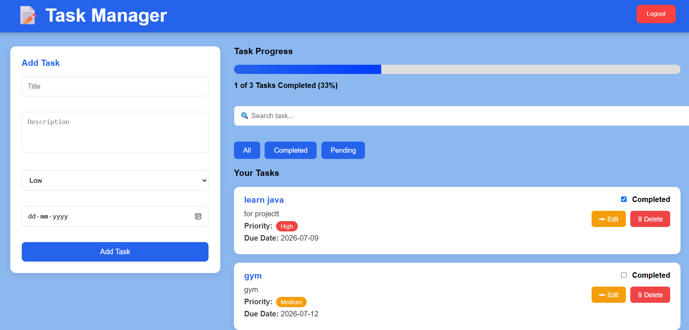
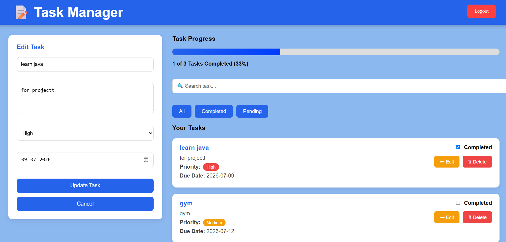
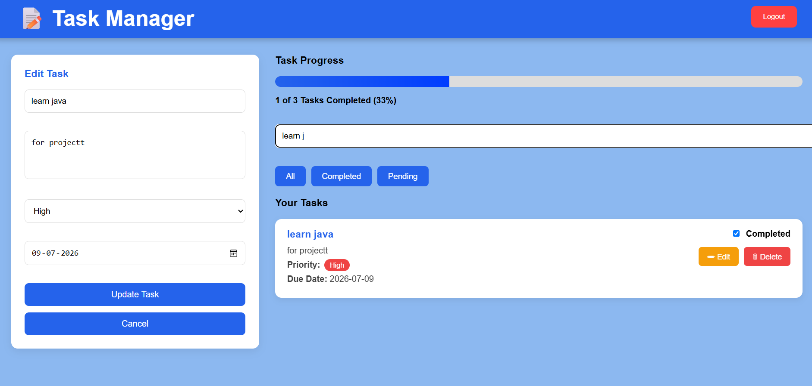

Task Manager:
Project Description:-

Task Manager is a full-stack web application built using React.js, Django REST Framework, and JWT Authentication.

Users can:

Register
Login
Create Tasks
Edit Tasks
Delete Tasks
Mark Tasks as Completed
Filter Tasks
Search Tasks
Track Task Progress

Technologies Used:

Frontend:
React.js
Axios
React Router

Backend:
Django
Django REST Framework
Simple JWT

Database:
PostgreSQL

Features:
User Authentication
JWT Login
CRUD Operations
Search Tasks
Filter Tasks
Due Date
Priority
Progress Bar

Backend Setup
1 Clone Repository
git clone <repository-url>
2 Go into project
cd TaskManager
3 Create Virtual Environment

Windows
python -m venv venv

Activate
venv\Scripts\activate

4 Install Packages
pip install -r requirements.txt

5 Configure Environment Variables
Create

.env

Add

SECRET_KEY=your_secret_key

DB_NAME=your_database_name

DB_USER=your_database_user

DB_PASSWORD=your_database_password

DB_HOST=localhost

DB_PORT=5432

6 Run Migrations
python manage.py migrate

7 Start Backend
python manage.py runserver

Backend runs at:

http://127.0.0.1:8000/

Frontend Setup
Open another terminal.

cd frontend

Install packages-

npm install

Run React

npm run dev

Frontend:

http://localhost:5173/

## Screenshots:
### Register

### Login

### Dashboard

### Edit Task

### Search Task

